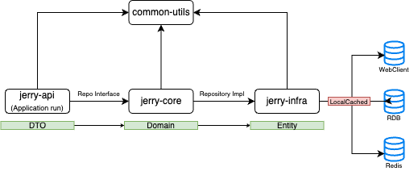

<h2> Jerry </h2>

> 장소 검색 Open API 데이터 서빙 및 검색 키워드 목록에 대한 랭킹 서비스 

### 주요 Library

```
Kotlin : 1.9.22
gradle : 8.10.2
springboot : 3.3.4
arrow : 1.2.1
java : openjdk-21
h2 : 2.3.232
r2dbc-h2 : 1.0.0.RELEASE
embedded-reis : 0.7.2
caffeine : 3.1.8
klint : 11.5.1
detekt : 1.23.5 
```
- kotlin-arrow : Functional Programming 및 Error Handling 장점으로 모든 구현을 arrow either 처리.
- h2 : 검색어 랭킹에 대한 장애처리 목적으로 내장된 H2 RDB 사용
- r2dbc-h2 : Reactive H2 DB 사용.
- embedded-redis : 검색어 조회 및 TOP-10 API 목적, 중복 실행에 대한 Key
- caffeine: Repository 외부 Data 가져오는 부분에 대한 Local Cache를 위해 Caffeine Cache를 선택함.
- klint/detekt : Code Convention을 위해 사용함.

## Features
```
Coroutine, WebClient, Reactive-Redis, R2DBC
-> 최대한 모든 요소에 대해 [비동기, non-blocking] 사용
```
### 프로젝트 모듈

* **common-utils**
  * 모든 모듈에서 공통으로 사용하는 Util Module
* **jerry-api**
  * **[관심사: 앞단(API 요청)]**
  * API 서비스 제공 Module 
    * 사용자 Input(RequestDTO)에 대한 Validation Check
    * API Response
      * Http Staus Code 
        * 200 : 정상
        * 400 : Bad Request
        * 500 : Server Error
    * 예상치 못한 Throw에 대한 CommonException Handler 정의
    * Controller(DTO)-Service(Domain)
* **jerry-core**
  * **[관심사: 순수 도메인]**
  * 순수 Domain 객체를 정의한 Module
  * DDD Architect
  * Controller(DTO)-Service(Domain)-Repository(Entity)
* **jerry-infra**
  * **[관심사: 뒷단(데이터)]**
  * 외부 Data를 가져오는 DataSource Module
  * jerry-infra를 제외한 다른 Module은 어떠한 Data Source에서 가져오는지에 대한 관심사가 없음
  * 다른 Module 변경 없이 Data Source 추가/변경이 쉬움 (Data Source 대한 결합도가 낮음)
  * Hexagonal Architect
  * Service(Domain)-Repository(Entity)

### Data Layer Definition
* **DTO** (jerry-api)
  * RequestDTO/ResponseDTO
* **Domain Pure** (jerry-core)
  * Domain
* **Entity** (jerry-infra)
  * R2dbcEntity
  * RedisEntity
  * WebclientRequest/WebclientResponse

### Service Flow
* **Search Keyword From OpenAPI**
  1. [WebClient] WebClient를 통해 Open API 호출
  2. [Redis] KeyWord redis zset increment 
     - launch(Job()) : 새로운 Job 실행으로 기존 Job과는 별개로 실행 (서로 에러 전파 X)
  3. [R2DBC] RankType과 Keyword로 데이터 조회
     - 2번 동일한 Job()에서 실행
  4. [Redis] 만약 Redis zset Score보다 RDB Score가 크다면 Redis 데이터 Increment 보정처리
     - 2번 동일한 Job()에서 실행
* **Search TOP-N**
  1. [Redis] 10개의 TOP-N Data 조회 (ZSET Range 조회, Score 내림차순)
  2. **구현하지못함, RDB 데이터는 존재함** / [RDB] Redis 조회 실패 시, RDB 조회
* **Data Sync Scheduled**
  * Spring @Scheduled 를 통해 주기적으로 실행함
  * 중복되지 않도록 Aspect 정의 (CheckRunning)
  * N개의 Container 및 서버에 띄워져 있을때도 중복발생하지 않도록 조치
  1. [AOP] CheckRunning
  2. [Redis] Key 검사
     - Redis 내 Key 존재하면 Running
     - Redis 내 Key 존재하지 않으면 Key Set + Data Sync 실행
  3. [RDB] RankType별, 모든 데이터 조회
  4. [Redis] RankType별, 모든 데이터 조회
  5. [RDB] Redis 기준으로 UPDATE/INSERT Data Sync


### Local Cache
* **Cache 관심사 : infra**
* WebClient
  * 카카오 키워드 장소 검색 Open API
    * 5분 로컬 캐시
    * keyword 100개까지 Cache
  * 네이버 키워드 장소 검색 Open API
    * 5분 로컬 캐시
    * keyword 100개까지 Cache
  * TOP-N Redis 검색
    * 10초 로컬 캐시
    * 10개의 RankType까지 Cache

### 저장소
* **RDB(H2)**
  * Keyword 검색 Count 데이터 장애처리를 위해 Sync
* **Embedded-Redis**
  * ZSET 사용 (TOP-N 조회)
  * CheckRunning AOP - 중복 실행 방지를 위한 Key Set 사용

## Q&A 및 점검
* 프로그램의 지속적 유지보수 및 확장에 용이한 아키텍처에 대한 설계
  * DDD/Hexagonal Architecture로 유지보수성/확장성이 좋음
  * 결합도가 낮고 응집력이 높은 설계
* 동시성 이슈가 발생할 수 있는 부분을 염두에 둔 설계 및 구현(예시.키워드별로 검색된 횟수)
  * Redis ZSET을 사용(Single Thread 동작)
  * RedisTemplate increment 내부 구현 사용
* 카카오,네이버 등 검색 API 제공자의 “다양한” 장애 및 연동 오류 발생 상황에 대한 고려
  * "다양한" 장애는 고려하지 못함.
  * 장애상황에 대해서는 둘 중 하나만 성공해도 API 정상처리되도록 구현
* 대용량 트래픽 처리를 위한 반응성(Low Latency)/확장성(Scalability)/가용성(Availability)을 높이기 위한 고려
  * LocalCache(Caffeine) 사용 고려함
  * 코루틴 non-blocking(async-await)를 이용하여 반응성이 높임
* 테스트 코드를 통한 프로그램 검증 및 테스트 용이성(Testability)을 높이기 위한 코드/설계
  * 복잡한 Logic에 대해서는 TestCode 작성함
* 구글 장소 검색 등 새로운 검색 API 제공자의 추가 시 변경 영역 최소화에대한 고려
  * 구글 Open API가 추가된다면 jerry-infra만 수정 처리하여 가능한 구조
  * Service는 Data Source에는 관심 없음
  * Domain 기존과 동일하게 처리